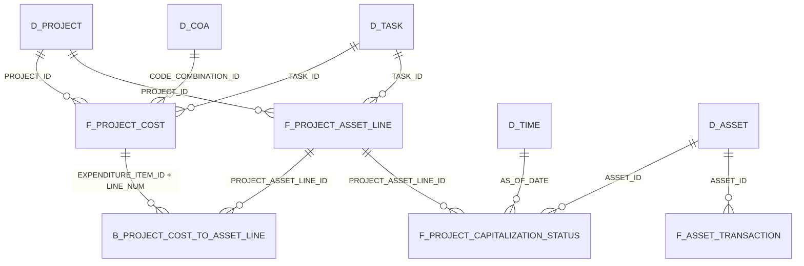

# ERD (CapEx Lifecycle)
See README and `docs/conceptual/capex-lifecycle.md` for scope. P2C process stages in `docs/conceptual/procure-to-capitalize.md`. Use this doc for future diagrams (dbdiagram, draw.io).

## Active Collect-to-Capitalize traceability

`B_Project_Cost_To_Asset_Line` is a non-additive lineage bridge at `PROJ_ASSET_LINE_DTL_UNIQ_ID` + `PROJECT_ASSET_LINE_ID`. A source cost can split to multiple asset lines, so the ERD represents drill/filter paths rather than permission to sum repeated cost after the join. The status fact is an as-of snapshot: select one `AS_OF_DATE` before aggregating.

Posted `ASSET_ID` provides the governed path from Projects to FA facts. Candidate flags on the status fact identify records for review only; they do not establish an accounting error or a capitalization conclusion.
