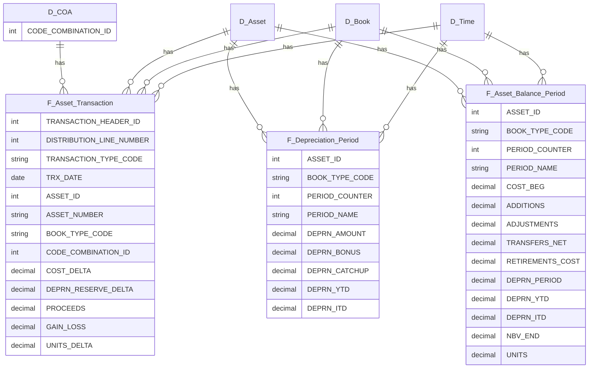

# Fixed Assets Subledger (Oracle Fusion 26B)

[](https://docs.oracle.com/en/cloud/saas/financials/26b/oedmf/index.html)

## Purpose
Subledger-only star schema for Oracle Fusion **Fixed Assets** (26B). Source = BI Publisher (OTBI) → CSV → Power BI today; later pivot to BICC → Fabric with the same column contracts.

- Scope: Fixed Assets subledger only (no SLA).
- COA Join: `CODE_COMBINATION_ID` into governed COA.
- Use Cases: rollforwards, depreciation, additions/retirements, account-level analytics.

## Portability Boundary
This repository is intentionally a portable workspace for query and model artifacts that can move between a personal machine and a work machine.

Keep in scope:
- Oracle Fixed Assets SQL extracts in `sql/`
- Column contracts in `contracts/`
- Power BI query/model artifacts in `powerbi/`
- Design and lineage notes in `docs/`
- Lightweight validation scripts in `scripts/`

Keep out of scope:
- Application backends, API services, databases, OAuth/JWT code, and deployment configs
- Local data exports, `.pbix` files, generated caches, virtual environments, and secrets
- Machine-specific scratch projects that are not part of the Fixed Assets subledger workflow

## Data Flow
```

Fusion OTBI (BIP Logical SQL) → CSV files → Power BI
Later: Fusion BICC (PVO extracts) → Fabric Lakehouse → same model

```

Before exporting the Fixed Assets OTBI subject areas, run Oracle's **Extract Asset Reporting Data** / **Extract Assets Reporting Data** ESS process so the reporting extract tables are current. Oracle 26B documents these OTBI subject areas as extract-backed:
- Transactions: distribution-line grain via `FA_TRX_EXTRACT`
- Depreciation: depreciation-distribution grain via `FA_DEPRN_EXTRACT`
- Balances: transaction-distribution-line grain via `FA_BALANCES_EXTRACT`

## Facts & Dimensions
**Facts**
- **F_Asset_Transaction** (distribution grain)
  - Keys: TRANSACTION_HEADER_ID, DISTRIBUTION_LINE_NUMBER, ASSET_ID, BOOK_TYPE_CODE, TRX_DATE, CODE_COMBINATION_ID
  - Measures: COST_DELTA, DEPRN_RESERVE_DELTA, PROCEEDS, GAIN_LOSS, UNITS_DELTA
- **F_Depreciation_Period** (asset×book×period; aggregated from OTBI depreciation distribution grain)
  - Keys: ASSET_ID, BOOK_TYPE_CODE, PERIOD_COUNTER
  - Measures: DEPRN_AMOUNT, DEPRN_BONUS, DEPRN_CATCHUP, DEPRN_YTD, DEPRN_ITD
- **F_Asset_Balance_Period** (asset×book×period snapshot; aggregated from OTBI balance distribution grain)
  - Keys: ASSET_ID, BOOK_TYPE_CODE, PERIOD_COUNTER
  - Measures: COST_BEG, ADDITIONS, ADJUSTMENTS, TRANSFERS_NET, RETIREMENTS_COST, DEPRN_PERIOD, DEPRN_YTD, DEPRN_ITD, NBV_END, UNITS

**Dimensions**: D_Asset (FA_ADDITIONS_B), D_Book (FA_BOOKS), D_Category, D_Location, D_Time (with FA calendar map), **D_COA (PK = CODE_COMBINATION_ID)**.

### Transaction Grain
Oracle documents `Fixed Assets - Asset Transactions Real Time` at asset transaction distribution-line grain. This repo therefore treats distribution grain as canonical.

- **Canonical distribution grain:** `sql/bip/fa_transactions_distribution.sql`, contracts `contracts/fa_transactions.yml` and `contracts/fa_transactions_distribution.yml`, file `fa_transactions_distribution_{yyyymm}.csv`.
  - Pros: preserves exact account splits via `CODE_COMBINATION_ID`.
  - Key: `[TRANSACTION_HEADER_ID, DISTRIBUTION_LINE_NUMBER]`.
- **Header summary convenience extract:** `sql/bip/fa_transactions_header.sql`, file `fa_transactions_header_{yyyymm}.csv`.
  - Use only for transaction-header summaries where account-level analysis is not needed.
  - It groups OTBI distribution rows to transaction header and intentionally omits `CODE_COMBINATION_ID`.

In Power BI, use the distribution extract as `F_Asset_Transaction`. Relationships remain COA by `CODE_COMBINATION_ID`.

## ERD (Mermaid)


## Bus Matrix (Kimball)
This repo follows a **bus architecture** with conformed dimensions across facts.  
See **[docs/bus-matrix.md](docs/bus-matrix.md)** for the Fixed Assets matrix and **[docs/bus-matrix-template.md](docs/bus-matrix-template.md)** to extend into other finance domains.

## Contracts-first
Column names/types live in `contracts/*.yml` and are the source of truth. Update contracts → SQL → PBI (in that order). CI validates contracts.

## Getting Started
1) Run Oracle's Fixed Assets reporting extract ESS process.
2) Use `sql/bip/*` in BI Publisher to export CSV partitions.
3) Point `powerbi/queries/*.m` at your CSV folder.
4) Set relationships:  
   - `F_Asset_Transaction[CODE_COMBINATION_ID] → D_COA[CODE_COMBINATION_ID]`  
   - Role-play Time: TRX_DATE vs PERIOD_COUNTER (use `USERELATIONSHIP` in measures).
5) Sanity checks: rollforward math + COA tie-out for a sample month.

## Release Discipline
- Anchored on **26B**. On quarterly updates, diff What's New and the Oracle 26B/next OEDMF and OTBI subject-area docs, then update contracts first.

License: MIT (or org standard).

## References

- **Current Release (26B)**  
  [Oracle Financials 26B Tables and Views](https://docs.oracle.com/en/cloud/saas/financials/26b/oedmf/index.html)  
  [Oracle Financials 26B OTBI Subject Areas](https://docs.oracle.com/en/cloud/saas/financials/26b/faofb/subject-areas-for-transactional-business-intelligence-in-financials.pdf)

- **General References**  
  - [Oracle Financials 26B Books](https://docs.oracle.com/en/cloud/saas/financials/26b/books.html)
